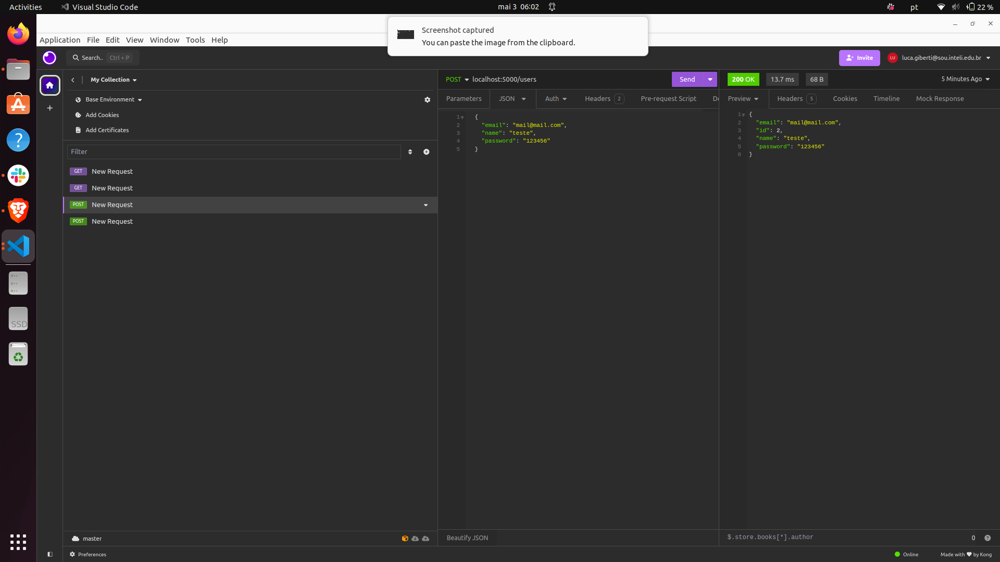
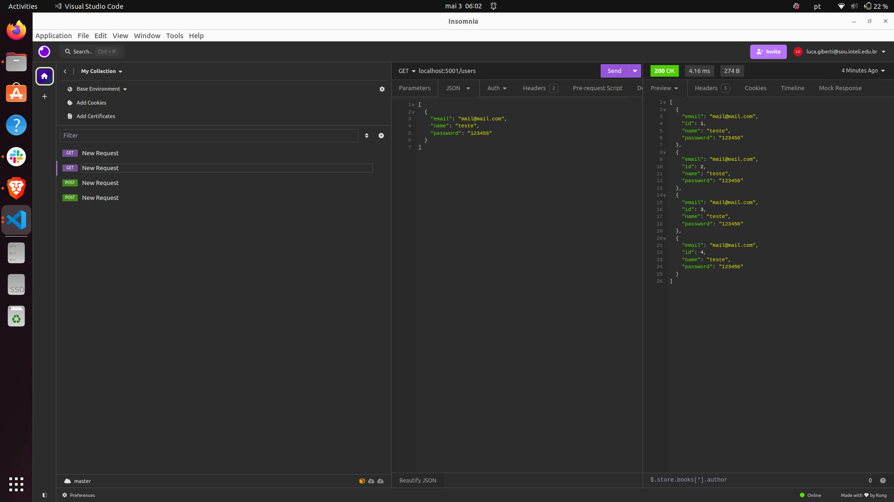
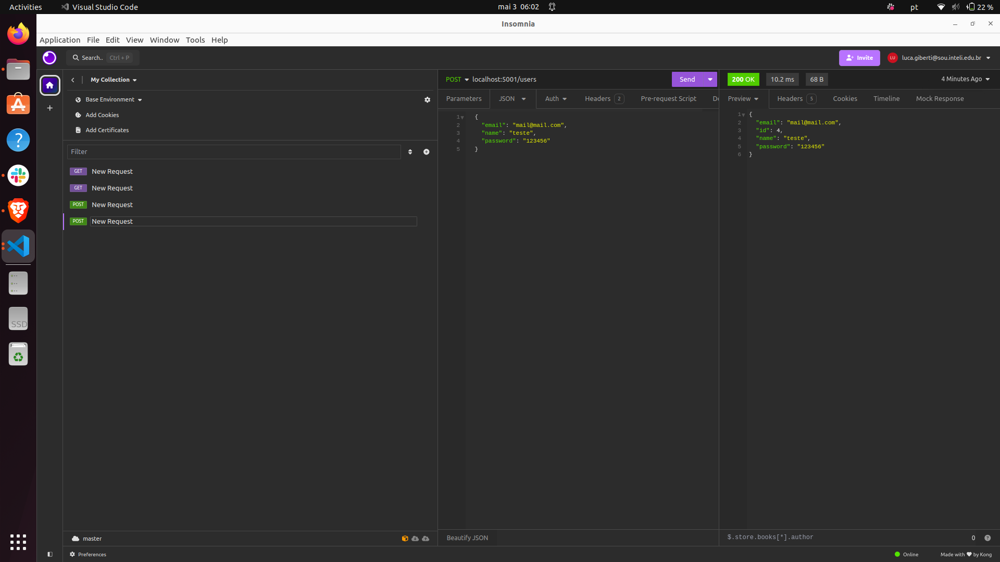

# Ponderada 1

Roda esse comando para a instalação das dependencias:

```
python3 -m pip install -r requirements.txt
```

Roda esse comando para a criação do banco de dados:

```
python3 main.py create_db
```

Roda esse comando para a execução da API:
```
python3 -m flask --app main run
```

Para rodar a aplicação é necessario rodar o seguinte commando:

```
sudo docker compose up
```
Sync:



async:


